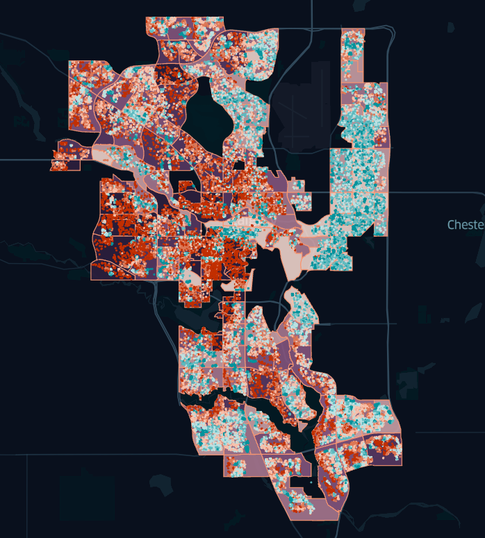

# Calgary Housing Price Prediction

When coming up with a listing price, a real-estate agent will conduct the appraisal process by employing a variety of methods; the most common appraisal method for houses is the sales comparison approach. The process is pretty intuitive: grab a list of comparables (i.e., properties that were sold and have similar features to the current one) from a database along with other pieces of information about the house (e.g., size of lot, number of bedrooms etc.), and extrapolate the price from the data.

The real-estate agent and client will then discuss and come up with a listing price. However, the true value of the house is still unknown, and may be far off from the listed price due to a variety of unknown reasons. For this reason, can a statistical model be used to predict housing prices accurately given similar information?

This analysis may be a great tool for all parties in a transaction: real-estate agents and sellers could use this information to be assured of their listing price, and buyers can determine whether or not the current estate is under/over-valued.

[Link to notebook in nbviewer](https://nbviewer.jupyter.org/github/nickdchee/CalgaryHousePricePrediction/blob/main/real-estate-prediction.ipynb)

